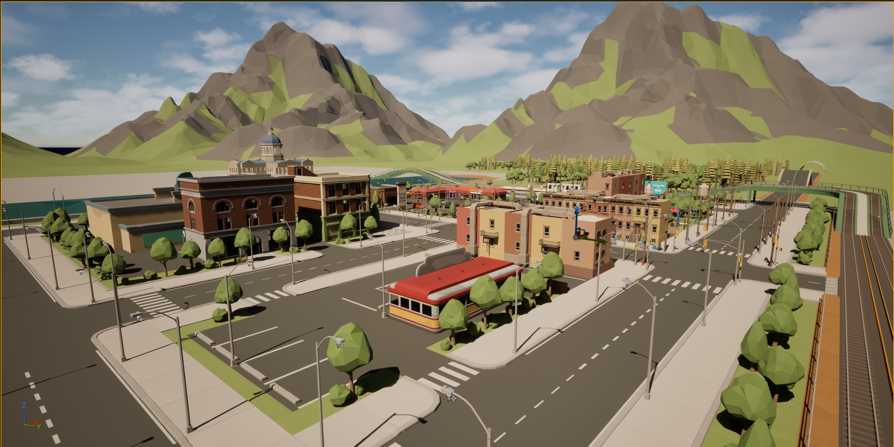
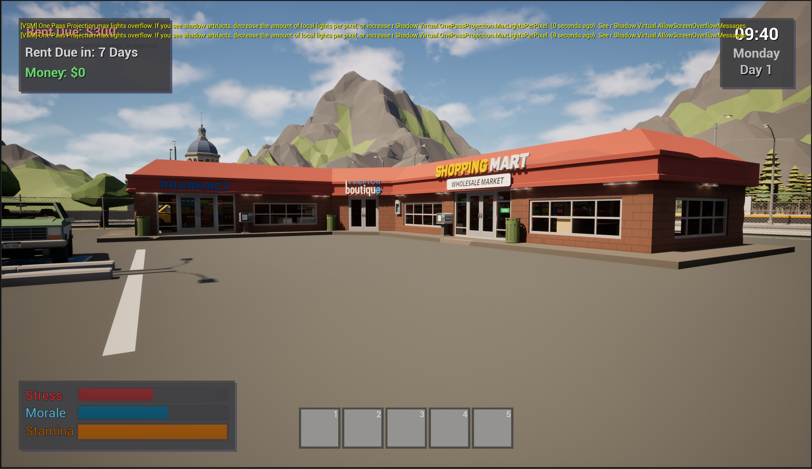
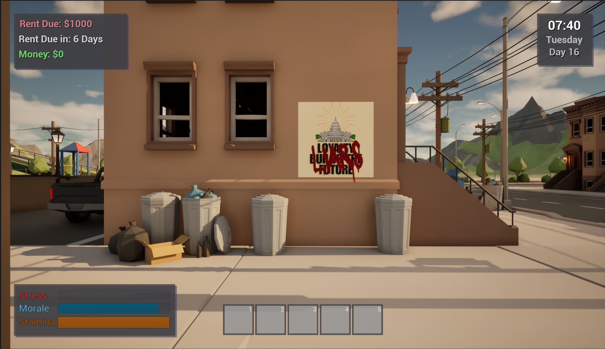
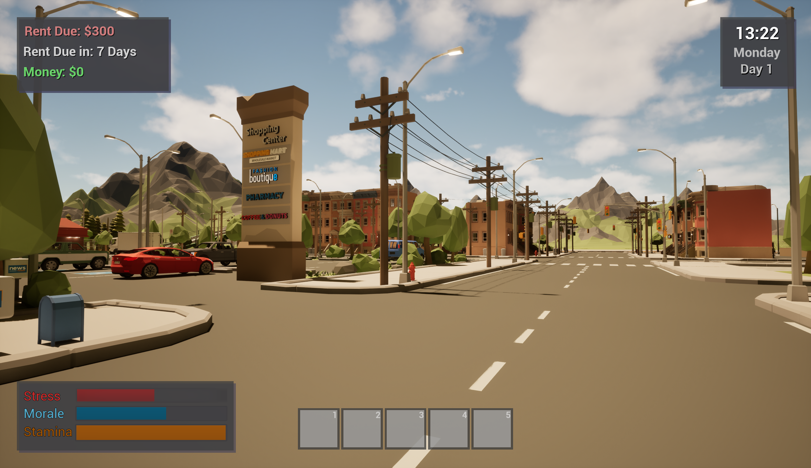
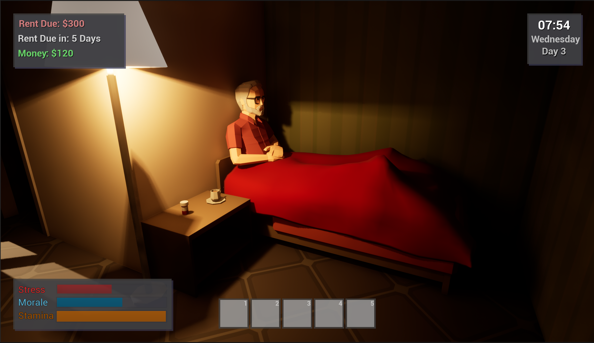
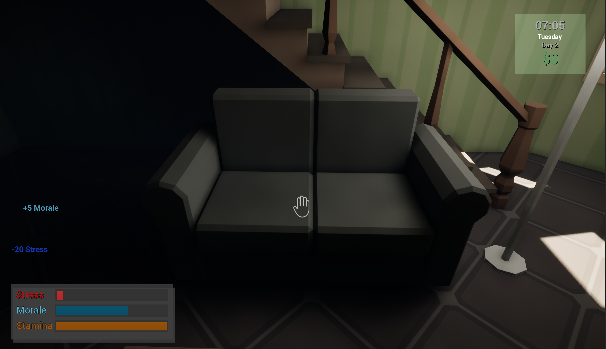
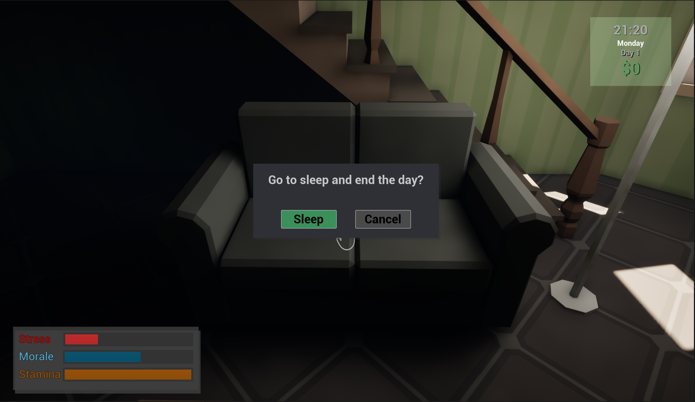

# State of Dissent – Development Log

State of Dissent is a solo-developed political life simulation game built in Unreal Engine 5.

This repository serves as a **development log and portfolio showcase** documenting the early gameplay systems, environment design, and mechanics created during the initial stages of development.

The goal of the project is to simulate life inside a city gradually experiencing **economic hardship, political unrest, and social instability**, where the player must manage their personal survival while navigating a changing world.

---

# Project Overview

State of Dissent focuses on the everyday life of a citizen living in a struggling city.  
Players must balance **work, finances, stress, morale, and stamina** while exploring an evolving urban environment.

The game is designed around **system-driven gameplay**, where player actions and city conditions influence each other over time.

Core themes include:

- Economic pressure
- Personal wellbeing
- Social tension
- Urban decay
- Political unrest

---

# Current Development Stage

**Early Vertical Slice Prototype**

At this stage development has focused on building **core gameplay systems and the foundational city environment**.

Major mechanics and systems have already been implemented in a playable prototype.

---

# Gameplay Systems Implemented

### Time and Day Cycle
The game runs on an in-game clock that progresses throughout the day.  
Days advance when the player chooses to sleep.

### Work and Income System
Players can interact with a workplace terminal to complete a work shift advancing the day and earning money.

Pay varies depending on the time the player arrives for their shift.

### Stress System
Player actions such as running or working increase stress.

High stress represents the physical and mental toll of daily life. Too much stress will decrease morale. Very little to no stress will increase morale.

### Morale System
Morale represents the player's emotional wellbeing.

Stress and life circumstances affect morale.

### Stamina System
Stamina determines how long the player can sprint before becoming exhausted.

When stamina is depleted the player is forced to walk until recovery and gain stress from depleting stamina.

### Sleep System
Players can return to their apartment and sleep to advance to the next day.

Sleeping resets daily systems and allows the player to recover from stress.

---

# World Prototype

The current prototype city includes several districts and landmarks designed to support exploration and gameplay systems.

Environment areas currently implemented:

- Residential neighborhood with row houses
- Player apartment interior
- Neighborhood park and playground
- Cinema district
- Diner and commercial plaza
- Train line and rail corridor
- River and bridge crossing
- Government building across the river

The map layout is designed to create **distinct locations that can later host events, NPC activity, and story systems**.

---

# Screenshots

### City Overview

### Union District

### Gameplay Systems

### Stress and Morale System

### Player Apartment

### Stress and Morale meter after day slept

### End of Day System

# Visual Style

The project uses a **stylized low-poly environment style** to maintain performance while allowing a large playable world.

The art direction focuses on:

- Clean geometry
- Strong silhouettes
- Readable environments
- Recognizable city landmarks

This approach allows rapid iteration while maintaining visual clarity.

---

# Planned Systems

Future development will expand the simulation systems of the game.

Planned mechanics include:

- Rent and financial pressure systems
- Grocery and resource management
- NPC pedestrian behaviors
- City event system
- TV news broadcasts and world updates
- City decay and unrest indicators
- Protest and civil tension mechanics
- Taking care of elderly grandfather
- Neighbor events
- Romantic interests
- Multiple Endings

These systems will gradually transform the city into a **living simulation that reacts to player actions and world conditions**.

---

# Development Logs

Progress updates and development notes will be documented in the **devlogs** folder.

These logs will track system development, environment design, and gameplay experimentation throughout the project.

---

# Tools Used

Development tools for the project include:

- Unreal Engine 5
- Blueprint Visual Scripting
- Blender
- GitHub for documentation and development logs

---

# Author

**July Wellman**

This project is part of an ongoing effort to develop skills in **game systems design, simulation mechanics, and interactive world development**.

---

# Repository Purpose

This repository is intended as a **development log and portfolio showcase**, rather than a full source code repository.

It documents the design decisions, systems, and world building progress behind the early stages of **State of Dissent**.
